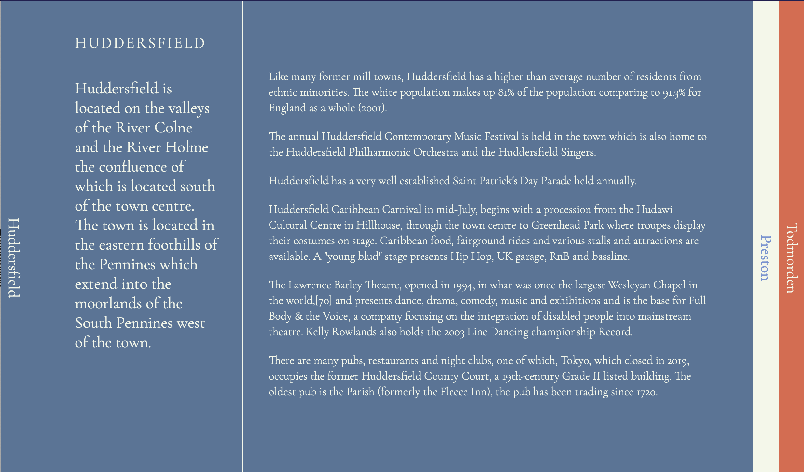

# Venlo - Project Scaffolding Tool

Venlo is a command-line scaffolding tool for setting up Astro and Next.js projects.

### Astro

```
~ ➜ npx venlo@latest
 __   __        _
 \ \ / /__ _ _ | |___
  \ V / -_) ' \| / _ \
   \_/\___|_||_|_\___/

? What will your project be called? wilson
? Will you be using Astro or Next? (Use arrow keys)
❯ astro
  next
```

```☁ brew@kelso:~ ➜ npx venlo@latest
 __   __        _
 \ \ / /__ _ _ | |___
  \ V / -_) ' \| / _ \
   \_/\___|_||_|_\___/

? What will your project be called? wilson
? Will you be using Astro or Next? astro
? How will you be handling json? node
? Choose a design
  default
  blank
  gists
  scroll
❯ booklet
  readme
```

```☁ brew@kelso:~ ➜ npx venlo@latest
__   __        _
\ \ / /__ _ _ | |___
\ V / -_) ' \| / _ \
 \_/\___|_||_|_\___/

? What will your project be called? wilson
? Will you be using Astro or Next? astro
? How will you be handling json? node
? Choose a design booklet
✔ wilson scaffolded successfully!
✔ wilson packages installed!
✔ wilson git repo created!
✔ wilson astro app created using booklet design
Next steps:
  cd wilson
  make start
```

## Features

- **Interactive CLI**: Guided prompts to help you make the best choices for your project.
- **Multiple Language Support**: Choose between Astro and Next for your project's foundation.
- **Backend Choices**: Handle JSON with either Node or Python.
- **Design Templates**: Multiple design choices including 'blank', 'default', 'gists', 'scroll', 'booklet', and 'readme'.
- **Custom Color Schemes**: Personalize project with the 'detective' or 'stuttgart' color schemes.

### In production

```bash
npx venlo@latest
```

### Local Development

Clone the repository:

```bash
git clone https://github.com/cerico/venlo.git
cd venlo
```

Install dependencies:

```bash
npm install
```

Run the CLI:

```bash
make generate
```

## Templates

Venlo provides a set of templates to kickstart your projects:

### Astro Templates

**Booklet**: A design template with tabbed content.

  

**Scroll**: A scroll-based design template.

  

**Gists**: A design template focused in a blog or gist style.

   

**Default**: A standard setup with multiple pages.

  

**Blank**: A minimalistic setup

   

**Readme**: A design template optimized for README-like content.

   

### NextJs Templates

A standard Next.js setup

   
````
